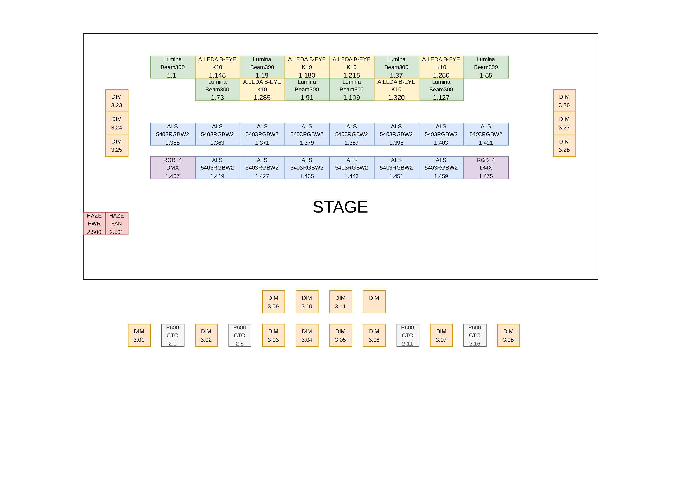

# DEWAN CHUNG KWO - Lighting Project

Welcome to the DEWAN CHUNG KWO lighting project repository. This repository contains the complete lighting patch, network infrastructure details, fixture personalities, and layout plans for the show.

## 🌐 Live Dashboard

We have built a modern, interactive dashboard hosted on GitHub Pages that allows you to easily search, sort, and view all patch information, as well as download fixture personalities directly.

**👉 [View the Live Dashboard Here](https://ChongZhiJie0216.github.io/DEWAN_CHUNG_KWO/)**

---

## 📋 Show Information

- **Showname:** DEWAN CHUNG KWO  
- **Date:** 14/12/25 - 15:39  
- **Software Version:** 16.0.670.5  
- **Console:** QTZ-58588 (Quartz)

### Network Configuration
| Device | IP Address | Subnet | MAC / Gateway |
| :--- | :--- | :--- | :--- |
| **Avolites** | `010.119.220.204` | `255.000.000.000` | `4C-4B-F9-4C-DC-CC` |
| **ART-NET** | `010.201.006.100` | `255.000.000.000` | `2-4D-48-C9-06-64` |

---

## 📁 Repository Structure

- `index.html`, `style.css`, `script.js`, `data.js` — Source code for the interactive GitHub Pages dashboard.
- `Personalities/` — Contains Avolites `.d4` fixture personality files available for download.
- `Images/` — Contains logos and layout diagram images.
- `Show Files/` — Backup and show files for the console.
- `HTMLReport.html` — The original static Avolites patch export report.

---

## 💡 Lighting Layout

*(A full PDF version `DEWAN_CHUNG_KWO_LIGHT_LAY_OUT.pdf` is also available in the repository root).*
